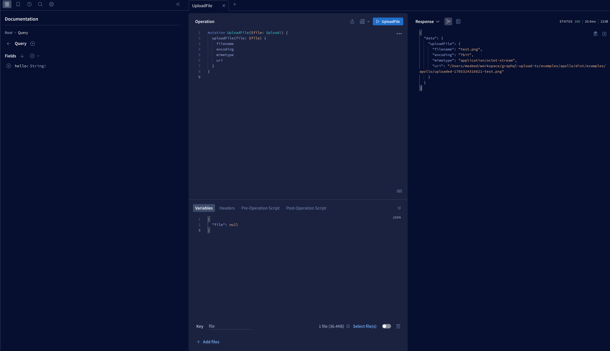
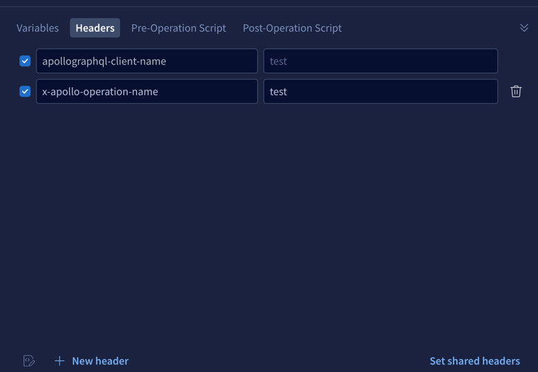

## Apollo Server Graphql Upload Example

This example shows how to use `graphql-upload-ts` with [Apollo Server](https://www.apollographql.com/docs/apollo-server/).

### Usage

```bash
# Install dependencies
yarn install

# Start the server
yarn start

# Test upload with cURL
./upload.sh http://localhost:4000/graphql test.png

```
### OR Open http://localhost:4000/graphql in a browser to use GraphQL Playground
#### and run the `uploadFile` mutation with the `test.png` file as images below



